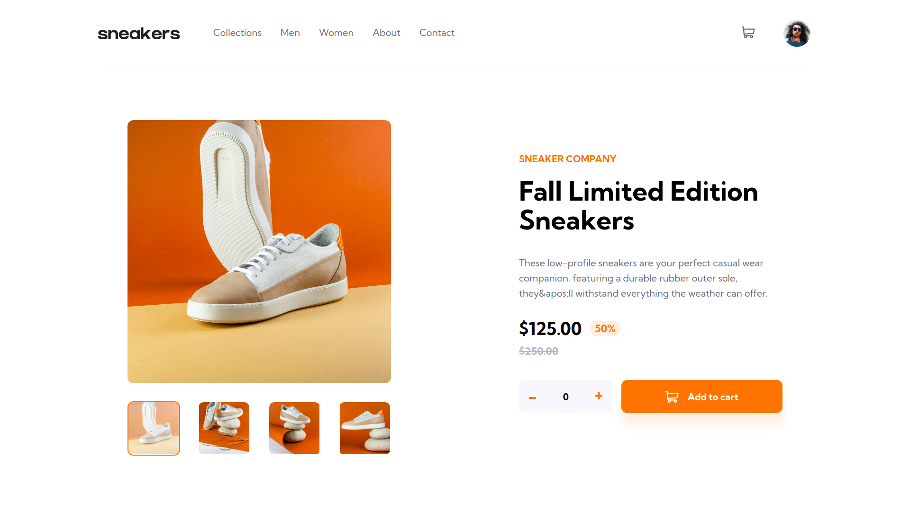
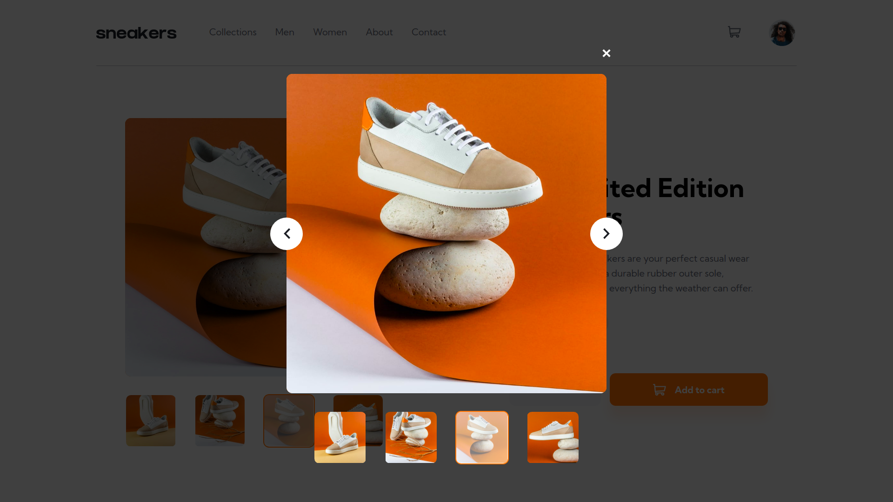
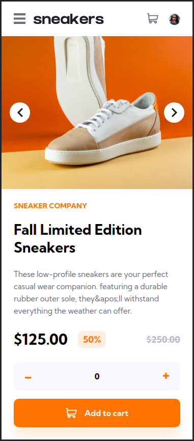
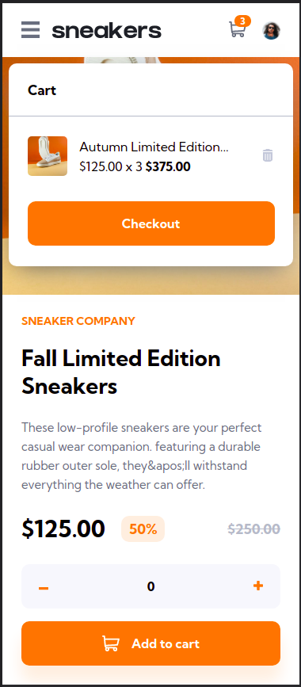
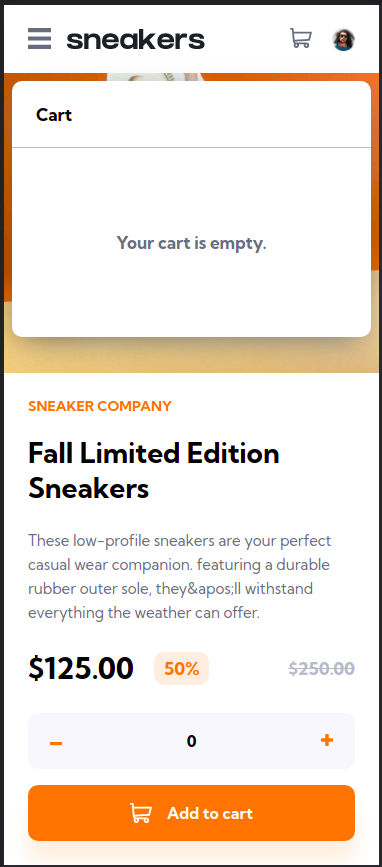

# Frontend Mentor - E-commerce product page solution

This is a solution to the [E-commerce product page challenge on Frontend Mentor](https://www.frontendmentor.io/challenges/ecommerce-product-page-UPsZ9MJp6). Frontend Mentor challenges help you improve your coding skills by building realistic projects.

### The challenge

Users should be able to:

- View the optimal layout for the site depending on their device's screen size
- See hover states for all interactive elements on the page
- Open a lightbox gallery by clicking on the large product image
- Switch the large product image by clicking on the small thumbnail images
- Add items to the cart
- View the cart and remove items from it

### Screenshots

  
  

Mobile

  
  
  

### Links

- Live Site URL: [Link](https://ecommerce-product-page-jonascavalcante.vercel.app)

### Built with

- Mobile-first workflow
- [React](https://reactjs.org/) - JS library
- [Styled Components](https://styled-components.com/) - For styles

### Author

- LinkedIn - [@jonascavalcante](https://www.linkedin.com/in/jonascavalcante)
- Frontend Mentor - [@jonascavalcante](https://www.frontendmentor.io/profile/jonascavalcante)
